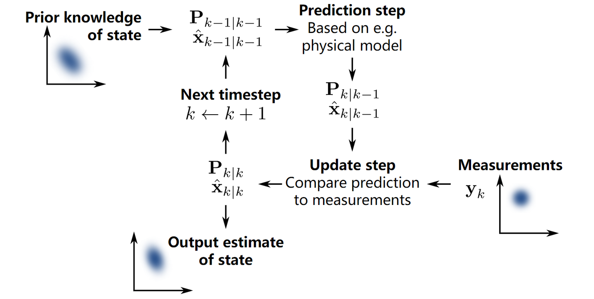
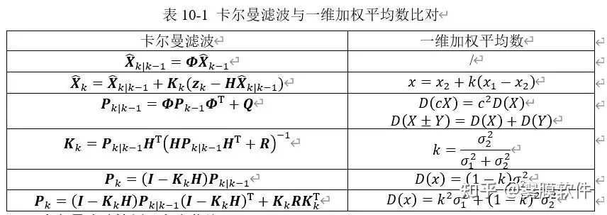

# 卡尔曼滤波(Kalman Filter) 101

## 0、从简单的开始

假设你有两个传感器，测的是同一个信号。可是它们每次的读数都不太一样，怎么办？  
***取平均。***  
再假设你知道其中贵的那个传感器应该准一些，便宜的那个应该差一些。那有比直接取平均更好的办法吗？  
***取加权平均***  
但是怎么取加权平均呢？假设两个传感器的误差都符合正态分布，假设你知道这两个正态分布的方差，用这两个方差值，你可以得到一个“最优”的权重。
> 我们假设两个相互独立的随机变量满足:
> $$X \sim N(\mu_1, \sigma_1^2)$$
>和
>$$Y \sim N(\mu_2, \sigma_2^2)$$
>则有$x = kx_1 +(1-k) x_2 = k(x_1-x_2) + x_2$  
>为了使其方差最小，经过一系列数学计算，我们可以得到
>$$k = \frac{\sigma_2^2}{\sigma_1^2+\sigma_2^2}$$
> **看！k就是最优权重**

上面是符合我们此前认知的情景。接下来，重点来了。假设我们只有一个传感器，但是我们还有一个数学模型。模型可以帮我们算出一个值，但也不是那么准。怎么办？  
***把模型算出来的值，和传感器测出的值，（就像两个传感器那样），取加权平均。***  
同理，经过一系列数学计算，我们也可以得到一个最优的权重$K$，我们叫他 `卡尔曼增益`。

但是，直到现在，我们讨论的都还是**某一个固定时刻**的情况。我们的测量和模型输出都只是一个时刻的值。现在假设这个信号**随时间变化**。比如你在跟踪一个移动的物体，它的位置在不断改变。你每隔一段时间收集一次传感器的读数，这样就形成了一个**时间序列**。

怎么办？你不能用同一个固定的权重$k$来对待所有时刻的数据，更不能把所有数据糊在一起算一个大平均。相反，你应该这样做：

> **迭代法**：
> - 第1步：根据上一时刻的结果，和你对系统的理解（数学模型），***预测***现在的状态
> - 第2步：新的传感器读数来了，结合这个预测值，用我们之前说的***加权平均***思想，得到现在时刻的最优估计
> - 第3步：这个最优估计将作为下一时刻的"上一时刻的结果"，重复第1步

这样，每一个时刻，我们都在做同样的事：**预测 → 测量 → 更新**。 这就是卡尔曼滤波的核心思想。  

## 1、系统建模
### 状态转移方程
现在，假设我们需要观测一辆小车的速度和位置，即要观察的状态$x =(p,v)$，同样的，我们考虑的状态通常是随时间变化的，所以我们为它打上下标，即$x_{k-1} =(p_{k-1}, v_{k-1})$代表第$k-1$时刻的状态量。  
如果我们要对小车进行控制，比如让小车加减速，可以用一个控制量$u_k$来表示，在这个例子中，取$u_k=a_k$，即选择控制小车的加速度。  
如此一来，我们可以按照最基本的牛顿运动定律写出小车下一时刻的状态$x_{k} =(p_{k}, v_{k})$：
$$
p_k = p_{k-1} + v \Delta t + \frac{1}{2}a_k (\Delta t)^2
$$

$$
v_k = v_{k-1} + a_k\Delta t
$$
为了方便表示，我们将它写成矩阵形式：
$$
x_k = F_k x_{k-1} + G_k a_k \quad \text{(状态转移方程)}
$$
其中，$F_k$（称为状态转移矩阵）为：
$$
F_k = 
\begin{pmatrix}
1 & \Delta t \\
0 & 1
\end{pmatrix} 
$$
$G_k$（称为控制输入矩阵）为：
$$
G_k = 
\begin{pmatrix}
\frac{1}{2}(\Delta t)^2 \\
\Delta t
\end{pmatrix}
$$
但是，现实的情况并没有那么理想，小车可能会受到外界的各种扰动，比如，轮胎打滑，地面崎岖等等，都会使得状态转移的过程中混入噪声干扰（我们称为过程噪声$w_k$），而且这个噪声往往是无法测量的。好在，很多情况下，我们可以认为这个噪声服从均值为零的正态分布，即:
$$
w_k \sim N(0,Q_k)
$$
其中，$Q_k$为协方差矩阵。  
那么把状态转移方程重写为
$$
x_k = F_k x_{k-1} + G_k u_k + w_k
$$
其中$u_k=a_k$。  
### 观测方程
上面的状态转移方程为我们提供了观察系统状态的一种方式。同时，我们还会利用各种传感器观测这个系统的各个状态量。比方说，我们利用GPS来观测这个小车的状态$z_k$，它和系统状态量的关系是：  
$$
z_k = H_k x_k
$$
其中的$H_k$是观测模型，它把系统真实状态空间映射成观测空间。显然，如果GPS能够观测这个小车的$p_{k}$和$v_{k}$，那么对应的$H_k$就是一个2维单位矩阵。  
同样的，观测时，也不可避免的存在噪声，我们将观测噪声记为$v_k$，也同样认为它服从均值为零的正态分布，即:
$$
v_k \sim N(0,R_k)
$$
$$
z_k = H_k x_k + v_k
$$
其中，$R_k$也为协方差矩阵。  

### 总结

**请牢记这两个公式：**
$$
x_k = F_k x_{k-1} + G_k u_k + w_k
$$
$$
z_k = H_k x_k + v_k
$$

>现在我们比较这两种方式得到的系统状态，容易想到，状态转移方程得到的系统状态在演变时会非常平滑，但它的不确定度会随着迭代而逐渐增大，因为误差会在一次次迭代的过程中不断累积。相反，由量测系统得到的状态不存在累积误差，但演变时也会很不平滑。这时我们就需要将两者得到的状态有效结合起来。这就是卡尔曼滤波做的事情了。

## 2、求取误差协方差矩阵  

在上一章节我们已经知道，我们对系统状态的估计不可能是完美的，因为总会受到过程噪声、测量噪声的影响。因此，我们不仅需要给出状态的估计值，还需要知道这个估计值有多大的不确定性，即定量评判这个估计值的优劣。这种不确定性通常用误差的协方差矩阵来描述。  
接下来，我们会尝试一步一步地推导误差协方差矩阵的表达式。

### 迭代初值与符号约定  

首先，假设我们已经获取了k-1时刻的系统状态作为初值，表示为$\hat{x}_{k-1|k-1}$。  
这个表达方式和我们在上面见到的略有不同：
- **帽子符号 $\hat{\cdot}$**：表示这是一个**估计值**，而不是真实值。真实的状态 $x_{k-1}$ 我们永远无法直接得到，我们能做的只是估计它。
- **双下标 $k-1|k-1$**：含义是"用到第 $k-1$ 时刻的所有信息，对第 $k-1$ 时刻状态的估计"，即**后验估计**。通俗的说，就是已经取加权平均后的估计量。

### 求取先验协方差

根据上面的状态转移公式，我们可以得到：
$$
\hat{x}_{k|k-1} = F_k \hat{x}_{k-1|k-1} + G_k u_k + w_k  \text{(2-1)}
$$
先求取$\hat{x}_{k|k-1}$的协方差矩阵，令$P_{k|k-1} = cov(\hat{x}_{k|k-1},\hat{x}_{k|k-1})$,简写为 $P_{k|k-1} = cov(\hat{x}_{k|k-1})$,即
$$
P_{k|k-1} = cov(F_k \hat{x}_{k-1|k-1} + G_k u_k + w_k) = F_k cov(\hat{x}_{k-1|k-1}) F_k^T + cov(G_k u_k) + Q_k \text{(2-2)}
$$
其中，$cov(G_k u_k)$为0,因为可以认为输入是已知控制量。整理一下，就是
$$
P_{k|k-1} = F_k P_{k-1|k-1} F_k^T + Q_k \text{(2-3)}
$$
式(2-3)是迭代的第一步，这告诉了我们，单纯按照运动模型来预测系统下一时刻的状态（即先验估计$\hat{x}_{k|k-1}$），它的不确定性是多少（即$P_{k|k-1}$）。
>至少这个式子现在看起来还挺简洁的

### 测量更新

现在我们有了先验估计和它的不确定性，与此同时，传感器给我们送来了一个新的测量值$z_k$。  
首先，要定义一个量来表示测量值$z_k$和我们预测的测量值$H_k \hat{x}_{k|k-1}$的差值，即残差:
$$
\tilde{y}_k = z_k - H_k \hat{x}_{k|k-1} \text{(2-4)}
$$
后验估计就是在这条“差距”上乘以一个权重，然后加到先验估计上：
$$
\hat{x}_{k|k} = \hat{x}_{k|k-1} + K_k \tilde{y}_k \text{(2-5)}
$$
这里的$K_k$就是我们梦寐以求的卡尔曼增益。它决定了我们到底该更相信模型，还是更相信传感器。

### 求取后验误差协方差

像对待先验估计一样，我们也需要知道后验估计的误差协方差$P_{k|k}$,这样才能知道这次融合后的结果到底有多可靠。  
因此，先定义后验估计误差：
$$
\tilde{x}_{k|k} = x_k - \hat{x}_{k|k}
$$
把上述的(2-4)\(2-5)式带入，经过整理，可以得到:
$$
\tilde{x}_{k|k} = (I - K_k H_k)(x_k - \hat{x}_{k|k-1}) - K_k v_k \text{(2-6)}
$$
$x_k - \hat{x}_{k|k-1}$这个表达式很眼熟，其实他就是先验误差$\tilde{x}_{k|k-1}$

然后，求取后验估计误差的协方差矩阵$cov(\tilde{x}_{k|k},\tilde{x}_{k|k})$，把式(2-6)带入，得
$$
cov(\tilde{x}_{k|k}) =(I-K_kH_k)cov(\tilde{x}_{k|k-1})(I-K_kH_k)^T + K_kR_kK_k^T    \text{(2-7)}
$$
我们注意这个式子中的$cov(\tilde{x}_{k|k-1})$(先验误差协方差)，他其实就是$cov(\hat{x}_{k|k-1})$。因为$\tilde{x}_{k|k-1} = x_k - \hat{x}_{k|k-1}$,而真值是个常量。
>根据概率论知识，一个随机变量加减一个常量后的方差不变。

为了简洁，我们用$P_{k|k}$来表示$cov(\tilde{x}_{k|k})$。整理一下，把它写成一个关于$K_k$的表达式：
$$
P_{k|k} = P_{k|k-1} - P_{k|k-1} H_k^T K_k^T - K_kH_kP_{k|k-1} + K_k H_k P_{k|k-1}H_k^TK_k^T + K_kR_kK_k^T
$$
$$
=P_{k|k-1} - K_kH_kP_{k|k-1} - P_{k|k-1} (K_kH_k)^T + K_k S_k K_k^T \text{(2-8)}
$$
其中,$S_k =  H_k P_{k|k-1}H_k^T + R_k$。
现在，我们已经求出了后验误差协方差矩阵的表达形式。
>我们离胜利不远了！

## 3、求卡尔曼增益$K_k$

在上一章，我们废了好大力气得出了$P_{k|k}$的表达式，这是因为我们需要它来衡量估计值的不确定性。不确定性越小越好，因此，我们 **希望$P_{k|k}$的迹(Trace)** 最小。
>***为什么是迹最小？***$P_{k|k}$ 是一个矩阵，不是一个数字，没法直接说“哪个更小”。我们需要把它压缩成一个标量来比较优劣，而 $tr(P_{k|k})$ 正好就是一个很自然的选择。  
因为协方差矩阵对角线元素就是各个状态量的方差，所以
>$$
tr(P_{k|k}) = \sum_i Var(x_i)
>$$
>也就是“总体不确定性”的总和。让它最小，就等价于让整体估计误差尽可能小。  
从优化角度看，迹运算还有一个好处：形式简单、可微，最后能推到出闭式解的$K_k$，这也是卡尔曼滤波这么优雅的关键之一。

接下来让我们一步步地求取$tr(P_{k|k})$对$K_k$的导数，并令其为0，从而求取最优卡尔曼增益$K_k$。  
由式(2-8)
$$
P_{k|k}=P_{k|k-1}-K_kH_kP_{k|k-1}-P_{k|k-1}(K_kH_k)^T+K_kS_kK_k^T
$$
其中
$$
S_k=H_kP_{k|k-1}H_k^T+R_k
$$

对两边取迹：
$$
tr(P_{k|k})=tr(P_{k|k-1})-2tr(K_kH_kP_{k|k-1})+tr(K_kS_kK_k^T)
$$
>这里的$2tr(K_kH_kP_{k|k-1})$是怎么来的？
>观察式2-8中的这两项：$K_kH_kP_{k|k-1}$和$P_{k|k-1}(K_kH_k)^T$。  
>由于协方差矩阵是对称矩阵，这两项其实互为转置。而$tr(A^T) = tr(A)$，所以这两项的迹相等。

利用矩阵求导常用结论：
$$
\frac{\partial}{\partial K}tr(KA)=A^T,\qquad
\frac{\partial}{\partial K}tr(KSK^T)=2KS\;(S=S^T)
$$
可得
$$
\frac{\partial\,tr(P_{k|k})}{\partial K_k}
=-2P_{k|k-1}H_k^T+2K_kS_k
$$

令导数为0：
$$
-2P_{k|k-1}H_k^T+2K_kS_k=0
$$
$$
K_kS_k=P_{k|k-1}H_k^T
$$
$$
K_k=P_{k|k-1}H_k^TS_k^{-1}
$$

代回$S_k$，得到卡尔曼增益的标准形式：
$$
K_k=P_{k|k-1}H_k^T\left(H_kP_{k|k-1}H_k^T+R_k\right)^{-1} \text{ (3-1) }
$$
>我们算出了最优的权重！

这就是最终结果。直观上看：  
- 当测量噪声$R_k$很大时，$K_k$变小，更相信模型预测；  
- 当先验不确定性$P_{k|k-1}$很大时，$K_k$变大，更相信测量值。

## 4、回代与更新

现在我们已经得到了最优卡尔曼增益：
$$
K_k=P_{k|k-1}H_k^T\left(H_kP_{k|k-1}H_k^T+R_k\right)^{-1}
$$

接下来做的事很直接：把它回代到更新公式里。  
先更新状态估计：
$$
\hat{x}_{k|k}=\hat{x}_{k|k-1}+K_k\left(z_k-H_k\hat{x}_{k|k-1}\right)
$$
再更新误差协方差：
$$
P_{k|k}=(I-K_kH_k)P_{k|k-1}(I-K_kH_k)^T+K_kR_kK_k^T
$$
>这个更新公式被称为Joseph Form。事实上，有一种更简洁的写法：
>$$
>P_{k|k}=(I-K_kH_k)P_{k|k-1}
>$$
>两者在**精确数学推导**里是等价的，但在计算机里会有浮点误差。简式在数值计算时更容易把协方差矩阵算得“不对称”甚至“非半正定”（出现负方差这种不合理现象）。
>而约瑟夫形式通过保留两项“平方项”结构，能更好地维持$P_{k|k}$的对称性与非负性，所以在工程实现里通常更稳、更推荐。

到这里，一次完整迭代就闭环了。每个时刻重复下面四步即可：
$$
\hat{x}_{k|k-1}=F_k\hat{x}_{k-1|k-1}+G_ku_k
$$
$$
P_{k|k-1}=F_kP_{k-1|k-1}F_k^T+Q_k
$$
$$
K_k=P_{k|k-1}H_k^T(H_kP_{k|k-1}H_k^T+R_k)^{-1}
$$
$$
\hat{x}_{k|k}=\hat{x}_{k|k-1}+K_k(z_k-H_k\hat{x}_{k|k-1}),\quad
P_{k|k}=(I-K_kH_k)P_{k|k-1}
$$

这就是卡尔曼滤波从“预测”到“更新”的完整主干流程。
>好耶！

## 5、与一维加权均值的比较
还记得我们在第0节说的吗？其实卡尔曼滤波就是多维的加权平均数，公式是完全对应的。

>WOW
## 6、参考文献

[知乎问答-如何通俗并尽可能详细地解释卡尔曼滤波？](https://www.zhihu.com/question/23971601/answer/26254459)

[知乎问答-卡尔曼滤波 Kalman Filter 之美在于什么？](https://www.zhihu.com/question/281995386/answer/16951584203)

[知乎专栏-卡尔曼滤波(Kalman filter) 含详细数学推导](https://zhuanlan.zhihu.com/p/134595781)
